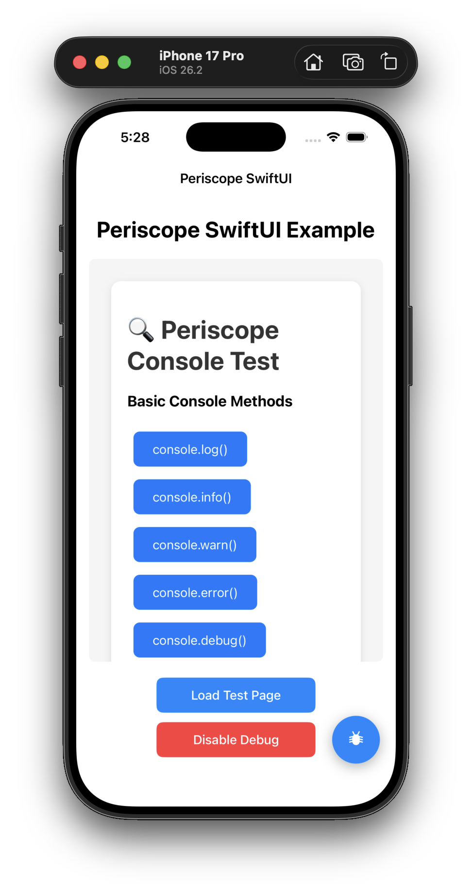
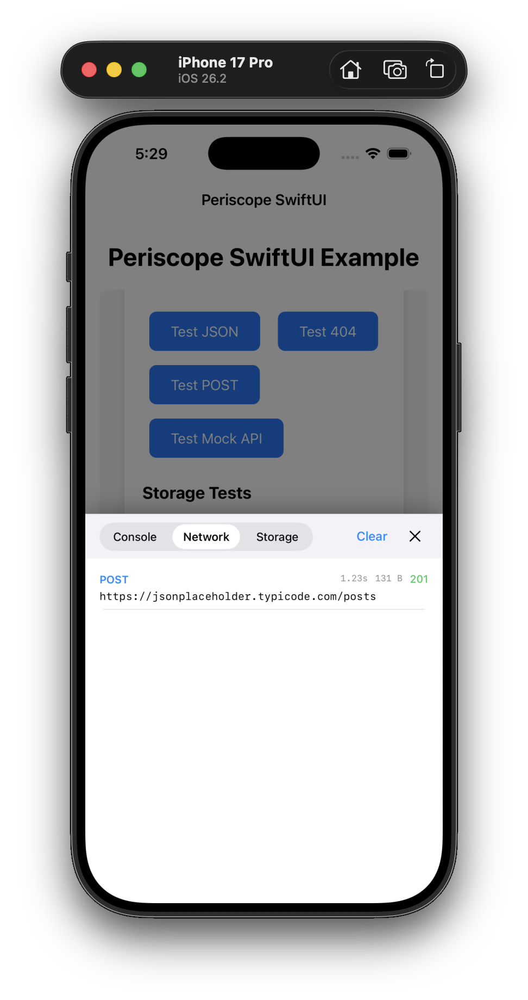
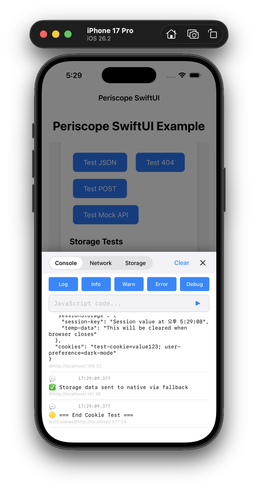

# 🔍 Periscope

**WebView 콘솔 디버깅을 위한 강력한 iOS 개발자 도구**

Periscope는 iOS 앱 내 WebView에서 발생하는 JavaScript 콘솔 로그, 네트워크 요청, 스토리지 데이터를 실시간으로 모니터링할 수 있는 디버깅 라이브러리입니다. 개발 과정에서 웹 콘텐츠와 네이티브 앱 간의 상호작용을 쉽게 디버깅할 수 있습니다.

## ✨ 주요 기능

- 📱 **실시간 콘솔 로그 모니터링**: JavaScript console.log, warn, error 등 모든 로그를 실시간으로 확인
- 🌐 **네트워크 요청 추적**: Fetch API 요청/응답을 상세히 모니터링
- 💾 **스토리지 데이터 확인**: localStorage, sessionStorage, Cookie 데이터를 실시간으로 추적
- 🎮 **플로팅 버튼 UI**: 앱 화면 위에 떠있는 디버그 버튼으로 쉬운 접근
- 📋 **다중 탭 인터페이스**: Console, Network, Storage 탭으로 정보를 체계적으로 분류
- 🔄 **UIKit & SwiftUI 지원**: 두 UI 프레임워크 모두에서 동일한 API 사용 가능

## 🛠 설치 방법

### Swift Package Manager

Xcode에서 패키지 추가:
1. **File → Add Package Dependencies...**
2. URL 입력: `https://github.com/shinseunguk/Periscope.git`
3. **Add Package** 클릭

또는 `Package.swift`에 직접 추가:

```swift
dependencies: [
    .package(url: "https://github.com/shinseunguk/Periscope.git", from: "1.0.0")
]
```

### CocoaPods

`Podfile`에 다음 내용 추가:

```ruby
pod 'Periscope', '~> 1.0.0'
```

설치 실행:
```bash
pod install
```

## 📱 시스템 요구사항

- **iOS 13.0+**
- **macOS 10.15+**
- **tvOS 13.0+**
- **watchOS 6.0+**
- **Swift 5.7+**

## 🚀 빠른 시작

### 1. 기본 설정

먼저 Periscope 모듈을 import하고 WKWebView에서 디버깅을 활성화하세요:

```swift
import Periscope
import WebKit

class ViewController: UIViewController {
    @IBOutlet weak var webView: WKWebView!
    
    override func viewDidLoad() {
        super.viewDidLoad()
        
        // Periscope 디버깅 활성화
        webView.enablePeriscope()
        
        // 웹페이지 로드
        let url = URL(string: "https://your-website.com")!
        webView.load(URLRequest(url: url))
    }
}
```

### 2. SwiftUI에서 사용

```swift
import SwiftUI
import WebKit
import Periscope

struct ContentView: View {
    @State private var webViewCoordinator = WebViewCoordinator()
    
    var body: some View {
        VStack {
            WebView(coordinator: webViewCoordinator)
                .onAppear {
                    // 화면이 나타나면 자동으로 디버깅 활성화
                    webViewCoordinator.enableDebug()
                }
            
            Text("Periscope Debug Enabled")
                .padding()
        }
    }
}

struct WebView: UIViewRepresentable {
    let coordinator: WebViewCoordinator
    
    func makeUIView(context: Context) -> WKWebView {
        let webView = WKWebView()
        coordinator.webView = webView
        
        // WebView 생성 후 바로 디버깅 활성화
        DispatchQueue.main.async {
            coordinator.enableDebug()
        }
        
        return webView
    }
    
    func updateUIView(_ uiView: WKWebView, context: Context) {}
}

class WebViewCoordinator: ObservableObject {
    var webView: WKWebView?
    
    func enableDebug() {
        webView?.enablePeriscope()
    }
}
```

## 🎯 상세 사용법

### 디버깅 활성화/비활성화

```swift
// 디버깅 활성화
webView.enablePeriscope()

// 디버깅 비활성화
webView.disablePeriscope()

// 편의 메서드 사용
PeriscopeSDK.enable(in: webView)
PeriscopeSDK.disable(in: webView)
```

### Debug Mode 설정

SDK 내부 로그를 확인하려면 Debug Mode를 활성화할 수 있습니다:

```swift
// Debug 모드 활성화 (SDK 내부 로그 출력)
PeriscopeSDK.setDebugMode(true)

// Debug 모드 비활성화 (기본값)
PeriscopeSDK.setDebugMode(false)
```

Debug Mode를 활성화하면 다음과 같은 내부 로그를 확인할 수 있습니다:
- WebView 메시지 핸들러 등록/해제
- JavaScript 스크립트 주입 상태
- 네트워크 요청/응답 처리
- Storage 데이터 캡처

**주의**: 프로덕션 환경에서는 Debug Mode를 비활성화하는 것을 권장합니다.

### 델리게이트 설정으로 고급 기능 활용

```swift
class ViewController: UIViewController {
    override func viewDidLoad() {
        super.viewDidLoad()
        
        // 델리게이트 설정
        PeriscopeDebugger.shared.delegate = self
        webView.enablePeriscope()
    }
}

extension ViewController: PeriscopeDebuggerDelegate {
    func periscopeDebugger(_ debugger: PeriscopeDebugger, didReceiveLog log: ConsoleLog) {
        print("📱 Native에서 로그 수신: [\(log.level.rawValue)] \(log.message)")
    }
    
    func periscopeDebuggerDidToggleVisibility(_ debugger: PeriscopeDebugger, isVisible: Bool) {
        print("📱 디버그 모달 상태: \(isVisible ? "표시됨" : "숨겨짐")")
    }
}
```

### 수동으로 디버거 제어

```swift
// 수동으로 플로팅 버튼 활성화
PeriscopeDebugger.shared.enable(in: view.window)

// 로그 수 제한 설정 (기본값: 1000)
PeriscopeDebugger.shared.maxLogCount = 500

// 모든 로그 가져오기
let allLogs = PeriscopeDebugger.shared.getAllLogs()

// 특정 레벨 로그만 필터링
let errorLogs = PeriscopeDebugger.shared.getFilteredLogs(levels: [.error])

// 로그 및 네트워크 요청 초기화
PeriscopeDebugger.shared.clearLogs()
PeriscopeDebugger.shared.clearNetworkRequests()
```

## 🖼 스크린샷

### 메인 화면


*플로팅 버튼을 통해 언제든지 디버그 콘솔에 접근할 수 있습니다.*

### 콘솔 탭


*JavaScript 콘솔 로그를 레벨별로 색상 구분하여 표시합니다.*

### 네트워크 탭


*모든 HTTP 요청과 응답을 상세히 추적할 수 있습니다.*

### 스토리지 탭


*localStorage, sessionStorage, Cookie 정보를 실시간으로 확인할 수 있습니다.*

## 📚 예제 프로젝트

이 저장소에는 두 가지 완전한 예제 프로젝트가 포함되어 있습니다:

### UIKit 예제
```bash
open PeriscopeUIKitExample/PeriscopeUIKitExample.xcodeproj
```
- WKWebView 기본 설정
- 버튼을 통한 디버깅 활성화/비활성화
- 델리게이트 패턴 활용 예시

### SwiftUI 예제
```bash
open PeriscopeSwiftUIExample/PeriscopeSwiftUIExample.xcodeproj
```
- SwiftUI와 UIViewRepresentable 활용
- 상태 관리를 통한 디버깅 제어
- 모던 SwiftUI 패턴 적용

두 예제 모두 테스트용 HTML 페이지를 포함하고 있어 즉시 Periscope의 모든 기능을 체험할 수 있습니다.

## 🧪 테스트 기능

Periscope는 다양한 테스트 시나리오를 제공합니다:

```javascript
// JavaScript 콘솔에서 직접 테스트 가능한 함수들
test()                    // 기본 테스트
calculate(5, 3)          // 계산 함수
testFetch()              // JSON API 호출 테스트
testPost()               // POST 요청 테스트
testStorage()            // 스토리지 테스트
testLocalStorage()       // localStorage 테스트
testSessionStorage()     // sessionStorage 테스트
testCookies()           // Cookie 테스트
```

## ⚙️ 고급 설정

### 로그 레벨 필터링

```swift
// 에러 로그만 표시
let errorLogs = PeriscopeDebugger.shared.getFilteredLogs(levels: [.error])

// 경고와 에러만 표시
let importantLogs = PeriscopeDebugger.shared.getFilteredLogs(levels: [.warn, .error])
```

### 네트워크 모니터링 커스터마이징

Periscope는 자동으로 `fetch()` API를 후킹하여 모든 HTTP 요청을 추적합니다:

- ✅ 요청 URL, 메서드, 헤더 정보
- ✅ 응답 상태 코드, 헤더, 본문
- ✅ 요청 소요 시간 측정
- ✅ 에러 상황 처리

### 스토리지 모니터링

다음 스토리지 변경 사항을 자동으로 감지합니다:

- `localStorage.setItem()`, `removeItem()`, `clear()`
- `sessionStorage.setItem()`, `removeItem()`, `clear()`
- `document.cookie` 변경

## 🔧 문제 해결

### 일반적인 문제들

1. **플로팅 버튼이 나타나지 않음**
   ```swift
   // Window 참조를 명시적으로 전달
   PeriscopeDebugger.shared.enable(in: view.window)
   ```

2. **로그가 표시되지 않음**
   ```swift
   // WebView 로드 후 디버깅 활성화
   webView.navigationDelegate = self
   
   func webView(_ webView: WKWebView, didFinish navigation: WKNavigation!) {
       webView.enablePeriscope()
   }
   ```

3. **스토리지 데이터가 업데이트되지 않음**
   - baseURL을 설정하여 WebView가 proper origin을 가지도록 해주세요
   ```swift
   webView.loadHTMLString(html, baseURL: URL(string: "http://localhost"))
   ```

### 디버깅 팁

- 콘솔에서 `window.__periscopeEnabled`로 현재 상태 확인
- JavaScript 에러가 발생하면 자동으로 에러 탭에 표시됩니다
- 네트워크 요청이 표시되지 않으면 `fetch()` API를 사용하는지 확인하세요

## 🤝 기여하기

Periscope 프로젝트에 기여하고 싶으시다면:

1. 이 저장소를 Fork하세요
2. 새로운 기능 브랜치를 만드세요: `git checkout -b feature/amazing-feature`
3. 변경사항을 커밋하세요: `git commit -m 'Add amazing feature'`
4. 브랜치에 Push하세요: `git push origin feature/amazing-feature`
5. Pull Request를 열어주세요

### 개발 환경 설정

```bash
git clone https://github.com/shinseunguk/Periscope.git
cd Periscope
open Periscope.xcworkspace
```

## 📄 라이센스

Periscope는 MIT 라이센스 하에 배포됩니다. 자세한 내용은 [LICENSE](LICENSE) 파일을 참조하세요.

## 👨‍💻 제작자

**shinseunguk**
- 이메일: krdut1@gmail.com
- GitHub: [@shinseunguk](https://github.com/shinseunguk)

---

**🌟 이 프로젝트가 도움이 되었다면 Star를 눌러주세요!**